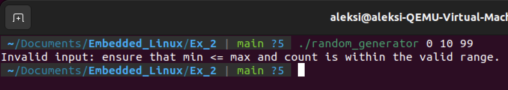

# Managing Linux with the Embedded Perspective

## Exercise 2
**Date:** 31.8.2024

### Step 1: Preprocessor
**File:** `main_preprocessed.c` — differences:

The preprocessed file is significantly larger than `main.c` because it includes the entire content of all the included header files (`<stdio.h>`, `random.h`, etc.). The file contains line markers (`# lines`) that help the compiler track the source of the code for error reporting. All macros defined in the headers are also expanded in the file. The preprocessed file is an intermediary step; it’s not intended to be human-readable but rather to be consumed by the compiler for the next steps of compilation.

### Step 2: Compilation

```bash
gcc -Wall -Wextra -Wfatal-errors -Wpedantic -c main.c random.c
```

#### Explanation of Compiler Flags

1. **-Wall**: This flag enables most of the common warnings about potential issues and helps catch common mistakes. It activates warnings such as unused variables, unreachable code, and other potential issues that might not prevent the code from compiling but could indicate bugs or bad practices.

2. **-Wextra**: This flag enables additional warning messages that are not covered by `-Wall` and are less common but can still be useful for catching potential issues. It includes warnings about things like unused parameters, signed/unsigned comparisons, and helps ensure that the code is more robust and follows best practices.

3. **-Wfatal-errors**: This flag tells the compiler to stop after the first error is encountered. Without this flag, the compiler will try to continue after encountering an error, reporting all the errors it finds in a single run. With `-Wfatal-errors`, the compiler will stop at the first error, which can make debugging easier because you can focus on one error at a time.

4. **-Wpedantic**: This flag enforces strict compliance with the C standard and gives warnings for any code that doesn't conform exactly to the standard, including things like extensions to the language that the compiler might support but are not part of the standard. It helps to ensure that the code is portable and adheres to the standards, which can be important in environments where you need strict compliance like embedded systems.

#### Additional Compiler Flags:

1. **Optimization Level (-O2)**: 

```bash
gcc -O2 -Wall -Wextra -Wfatal-errors -Wpedantic -o optimized_program main.c random.c
```

The `-O2` flag optimizes the code for performance, resulting in faster and smaller executables. However, debugging issues may arise that wouldn't without the flag as it did in my case. Also, debugging might be challenging as the optimized code may not correspond directly to the original source code.

The warnings I saw were related to the `scanf` function, which was flagged by the compiler because its return value wasn't being checked. I modified my code to check the return value of `scanf` to make sure that the input was successfully read.

2. **Debugging Flag (-g)**

```bash
gcc -g -Wall -Wextra -Wfatal-errors -Wpedantic -o debug_program main.c random.c
```

The `-g` flag tells the compiler to include debugging information in the compiled executable. This flag allows for debugging the program by setting breakpoints, stepping through the code, and inspecting variables to find and fix issues. I played around with this flag but had some difficulty stepping through the code and providing user input at the same time.

3. **Sanitization Flag (-fsanitize=address)**

```bash
gcc -fsanitize=address -g -Wall -Wextra -Wfatal-errors -Wpedantic -o asan_program main.c random.c
```

The sanitization flag detects memory errors at runtime, such as buffer overflows and memory leaks, providing detailed error reports. I introduced an intentional buffer overflow by attempting to write beyond the bounds of an array to see what happens. The output of this flag included the exact line of code causing the error, the memory address involved, and a stack trace leading to the error. The program was stopped as soon as the error was detected.

### Step 3: Linking

```bash
gcc -o random_generator main.o random.o
```

This command links the object files `main.o` and `random.o` together to produce the executable `random_generator`.

### Step 4: Program output screenshots:





